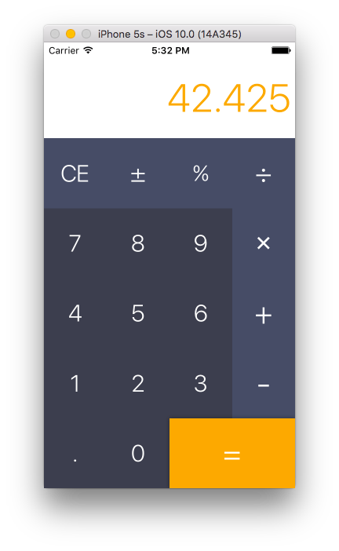

  

 

> Yet another simple calculator app.

## Motivation

This application was made during iOS-course in VK.com University.

## TODO

- [x] Improve design
- [x] Implement basic functionality
- [x] Make an app icon
- [ ] Implement % operation
- [x] Fix a bug with decimal separator
- [ ] Improve representation of numbers on the screen

## License

MIT © [Alexander Nelzin](https://asnelzin.com)
